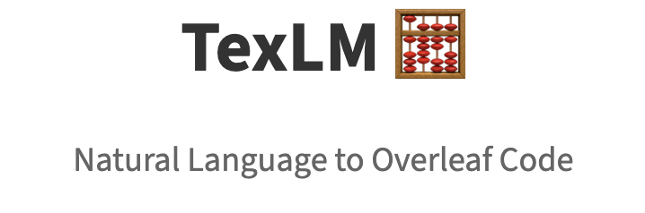

<p align="center">
  
</p>

<h1 align="center">TexLM</h1>
<p align="center">
  Natural Language → Matrix DSL → Verifiable LaTeX
</p>
<p align="center">
  <em>CSE291P course project · LLM + DSL for matrix operations</em>
</p>

---

## 🌐 Project Website

**Live demo:**  
http://47.76.240.140:32000/

---

## ✨ What is TexLM?

TexLM is an end‑to‑end system that converts **natural‑language matrix instructions** into:

1. A **grammar‑constrained matrix DSL**  
2. A **NumPy‑evaluated numerical result**
3. A **verifiable LaTeX snippet** using a constrained LaTeX core pattern

The pipeline is fully modular and supports:
- LLM‑based decomposition → DSL generation
- LLM verifier ensuring DSL matches original user intent
- AST execution with NumPy
- Constraint‑guided LaTeX rendering
- Streamlit web UI with feedback mailer
- Docker + Kubernetes deployment

Originally developed as a course project for **UCSD CSE291P**.

---

## 🧠 System Pipeline

### 1. Natural Language → DSL (LLM)
The system parses the user’s natural language request into:
- `dsl`: core matrix operation expression  
- `formatting`: requested output style  
- `reasoning`: chain‑of‑thought describing how DSL was produced  

Implementations:  
`dsl/generator.py`, prompts in `config/prompts.py`

---

### 2. DSL Verification (LLM)
Ensures:
- DSL matches **the original user request**, not a paraphrase
- No hallucinated operations
- Dimensions or matrix counts not invented

Returns:
```json
{
  "is_valid": true/false,
  "explanation": "why"
}
```

File: `dsl/verify.py`

---

### 3. DSL Execution (AST + NumPy)
Supported operations:
- `add(A, B)`
- `multiply(A, B)`
- `transpose(A)`
- `inverse(A)`
- Nested compositions (arbitrary depth)

Execution flow:
1. Parse DSL → AST  
2. Validate matrix shapes  
3. Run via NumPy  
4. Return result or error  

File: `dsl/evaluate.py`

---

### 4. LaTeX Core Generation
The numerical matrix is converted into a **LaTeX "core pattern"**, defining:
- Exact brackets
- Exact row/column structure
- Allowed float formatting patterns  

File: `constraints/generate_constraint.py`

---

### 5. Final LaTeX Rendering (LLM)
The LaTeX core is used as a **hard constraint**.  
LLM must produce a LaTeX snippet *consistent* with the core.

File: `renderers/latex.py`

---

### 6. UI (Streamlit App)
Features:
- Live chat  
- Expandable reasoning trace  
- Pretty LaTeX output  
- Feedback button that emails full chat log  

File: `app.py`

---

### 7. Email Feedback System
`utils/mailer.py` sends feedback emails with:
- User message
- DSL
- Trace
- LaTeX
- Full UI session transcript (attachment)

---

### 8. Deployment (Docker + Kubernetes)
- Dockerfile builds Streamlit app container  
- Kubernetes manifest (`k8s/deployment.yaml`) used for cloud hosting  
- Supports environment variables + Kubernetes secrets  

---

## 🗂 Project Structure

```
TexLM/
├── app.py                  # Streamlit web UI
├── main.py                 # Core end-to-end pipeline
├── config/
│   ├── config.py           # API key/env loader
│   └── prompts.py          # All LLM prompts
├── constraints/
│   └── generate_constraint.py
├── dsl/
│   ├── grammar.py          # DSL grammar definition
│   ├── generator.py        # NL → DSL
│   ├── verify.py           # DSL verifier
│   └── evaluate.py         # AST execution
├── renderers/
│   ├── decompose.py
│   └── latex.py            # LaTeX rendering with constraints
├── utils/
│   ├── mailer.py           # Email sender
│   └── ...
├── k8s/
│   └── deployment.yaml
├── Dockerfile
├── requirements.txt
└── README.md               # This file
```

---

## 🚀 Getting Started

### 1. Install Dependencies
```bash
git clone https://github.com/Ydz0616/TexLM
cd TexLM
python -m venv .venv
source .venv/bin/activate
pip install -r requirements.txt
```

---

### 2. Environment Variables

#### Local `.env` / `openai_key.env`
```
OPENAI_API_KEY=your-key
OPENAI_BASE_URL=https://your-relay/v1
EMAIL_USER=...
EMAIL_PASS=...
```

---

## 🖥 Run Web UI
```
streamlit run app.py
```
Visit:  
http://localhost:8501/

---

## 🧪 Run Programmatically

```python
from main import run_demo

msg = "give me a latex table of inverse of transpose of matrix ([1,2],[3,4])"

res = run_demo(msg)

print(res["dsl"])
print(res["final_latex"])
```

---

## 🐳 Docker

```
docker build -t texlm .
docker run -p 8501:8501 \
  -e OPENAI_API_KEY=... \
  texlm
```

---

## ☸ Kubernetes
`k8s/deployment.yaml` includes:
- deployment
- env var injection
- image `yz743/texlm:v0.2.1`

Apply:
```
kubectl apply -f k8s/deployment.yaml
```

---

## 🔧 Extending TexLM

### Add new matrix ops:
- Update `dsl/grammar.py`
- Implement logic in `dsl/evaluate.py`
- Update prompts

### Improve LaTeX rendering:
- Add custom table styles
- pmatrix / bmatrix switching
- Align environments

### Improve verification rules:
- Enforce stricter dimension checks
- Validate matrix counts / shapes

---

## ⚠️ Known Limitations

- Natural language is ambiguous — system may need rephrasing  
- DSL grammar currently supports a limited set of operations  
- Numerical precision may affect LaTeX formatting  
- Requires an LLM backend for DSL + rendering  

---

## 📜 License

Educational project for UCSD CSE291P.

Citation:
> Y. Zhang, TexLM: Natural Language → Matrix DSL → LaTeX, 2025  
> https://github.com/Ydz0616/TexLM
